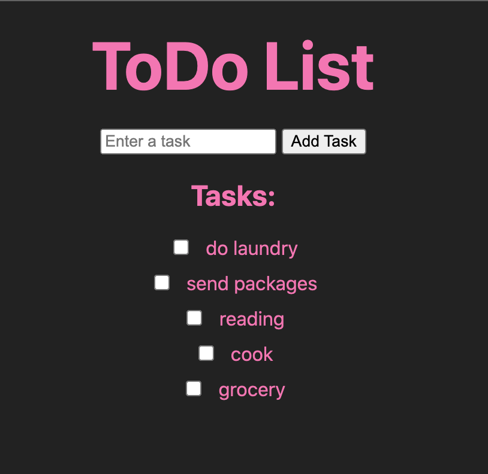

# ToDo List Web Application

This project is a simple ToDo List web application built using Node.js, Express.js, and EJS. The application allows users to create and manage tasks, view task lists, and mark tasks as completed.

## Features

- Task Creation: Users can create new tasks by entering task details in a form.
- Task Viewing: Users can view a list of all their tasks.
- Task Completion: Users can mark tasks as completed by checking a checkbox.
- Segmented Lists: Users can access different task lists, such as day's tasks and work-related tasks.
- Styling: The application is styled for a responsive and user-friendly experience on various devices.

## Technologies Used

- Node.js: A JavaScript runtime used to build the server-side logic.
- Express.js: A web application framework for routing and handling HTTP requests.
- EJS (Embedded JavaScript): A templating engine for generating dynamic HTML templates.
- CSS: Cascading Style Sheets for styling the application.

## Installation

1. Clone this repository to your local machine.
2. Navigate to the project directory: `cd capstone-todolist-project`
3. Install dependencies: `npm install`
4. Start the server: `node app.js`
5. Open a web browser and visit: `http://localhost:3000`

## Usage

1. On the home page, enter a task in the input field and click "Add Task" to create a new task.
2. Tasks will be listed below the input field. You can check tasks as completed by clicking the checkbox.
3. Use the alternative lists to view different sets of tasks (e.g., work-related tasks).